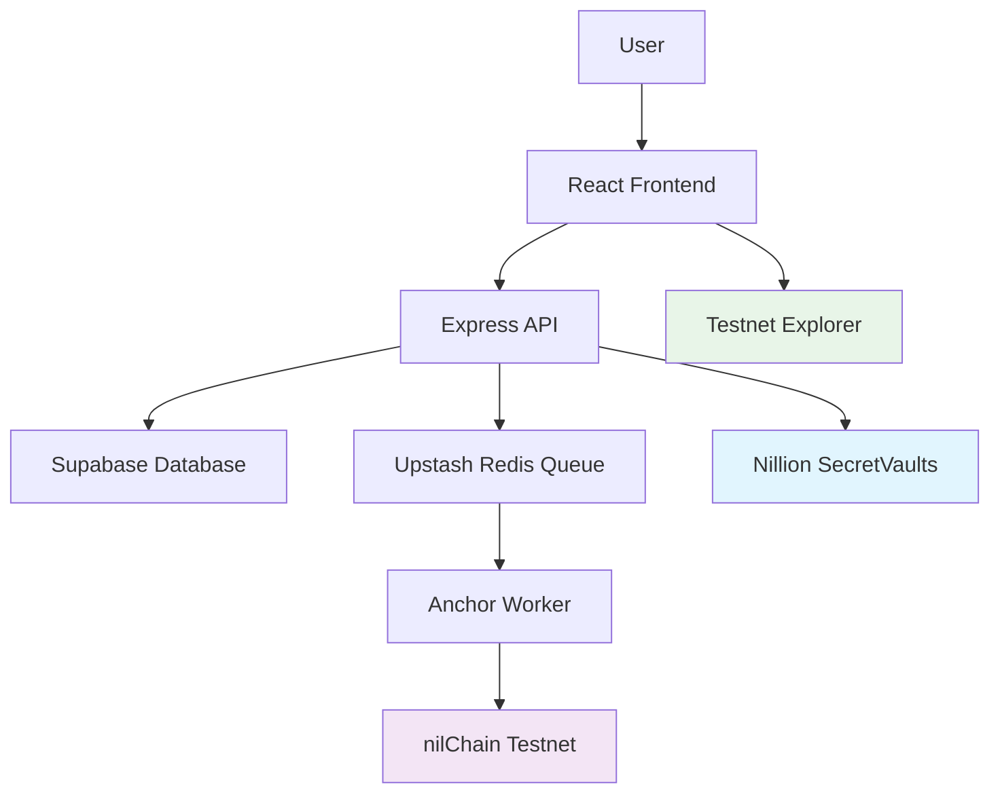

# 🔐 NillionVault

[](https://opensource.org/licenses/MIT)
[](https://nodejs.org/)
[](https://www.typescriptlang.org/)
[](https://nillion.com/)

> **A complete credential anchoring system that stores encrypted data in Nillion SecretVaults and anchors proof hashes to the nilChain testnet for immutable public verification.**

## ✨ Features

- 🔒 **Encrypted Storage** - Data stored in Nillion SecretVaults
- ⛓️ **Blockchain Anchoring** - Proof hashes anchored to nilChain testnet  
- 🔍 **Public Verification** - Anyone can verify credentials independently
- 🔄 **Reproducible Proofs** - Canonical hashing ensures consistency
- 📊 **Real Transactions** - Actual testnet transactions with explorer links
- 📝 **Audit Trail** - Complete operation logging
- 🆓 **Free Tier Ready** - All services use free tiers
- 🚀 **Production Ready** - Fully functional and deployable

## 🏗️ Architecture



**Technology Stack:**
- **Frontend**: React/Next.js on Vercel
- **Backend**: Node.js/Express on Render  
- **Database**: Supabase (PostgreSQL)
- **Queue**: Upstash Redis
- **Storage**: Nillion SecretVaults (encrypted)
- **Blockchain**: nilChain testnet (anchoring)

## 🎯 Use Cases

- **Educational Institutions** - Secure diploma and certificate verification
- **Professional Certification Bodies** - Industry credential validation
- **Healthcare Organizations** - Medical record and vaccination verification
- **Financial Institutions** - Identity and document verification
- **Government Agencies** - Official document authentication
- **Any Organization** - Requiring tamper-proof credential verification

## Quick Start

### 1. Prerequisites
- Node.js 18+ and npm
- Git

### 2. Set up accounts
- [Nillion Wallet](https://docs.nillion.com/community/guides/nillion-wallet) - Create wallet
- [Nillion Testnet Faucet](https://faucet.testnet.nillion.com/) - Get 0.1 NIL daily
- [nilPay Subscription](https://nilpay.vercel.app/) - Subscribe to nilDB service (28 NIL/month)
- [Supabase Project](https://supabase.com/pricing)
- [Upstash Redis](https://upstash.com/docs/redis/overall/pricing)

**⚠️ Important**: You need 28 NIL tokens to subscribe to nilDB service. See [docs/get-nil-tokens.md](docs/get-nil-tokens.md) for options.

### 3. Clone and setup
```bash
git clone <repo>
cd NillionVault

# Run setup script (Unix/Linux/macOS)
./scripts/setup.sh

# Or setup manually:
# Backend
cd backend
npm install
cp env.example .env  # Add your credentials
npm run dev

# Frontend  
cd ../frontend
npm install
cp env.example .env.local  # Add your API URL
npm run dev
```

### 4. Database setup
Run the SQL schema from `database/schema.sql` in your Supabase SQL editor.

### 5. Set up real Nillion services (Optional)
```bash
# Run Nillion setup script
./scripts/setup-nillion.sh

# Or follow manual setup in docs/nillion-setup-guide.md
```

### 6. Test the system
- Upload a credential at http://localhost:3000
- Get the proof hash
- Verify it at http://localhost:3000/verify
- View transaction on [testnet explorer](https://testnet.nillion.explorers.guru)

## 🚀 Live Demo

**Coming Soon!** Once deployed with real Nillion services, you'll be able to:

1. **Upload Credentials** - Try uploading a file or JSON data
2. **View Proof Hash** - See the unique cryptographic identifier
3. **Verify on Blockchain** - Check the transaction on testnet explorer
4. **Independent Verification** - Use our tools to verify authenticity

## 📊 Project Status

| Component | Status | Description |
|-----------|--------|-------------|
| ✅ Core Architecture | Complete | Full-stack implementation ready |
| ✅ Frontend UI | Complete | Modern React/Next.js interface |
| ✅ Backend API | Complete | Express server with all endpoints |
| ✅ Database Schema | Complete | Supabase PostgreSQL with audit logs |
| ✅ Queue System | Complete | Upstash Redis for background jobs |
| 🔄 Nillion Integration | In Progress | Real SecretVaults SDK integration |
| 🔄 Blockchain Anchoring | In Progress | nilChain testnet transactions |
| ✅ Documentation | Complete | Comprehensive guides and examples |
| ✅ Deployment | Complete | Production-ready configurations |

## Verification Process

Anyone can independently verify an anchor:

1. **Reproduce proof hash**:
   ```bash
   node tools/hash.js <credential-file>
   ```

2. **Check blockchain**:
   - Visit the txHash on testnet explorer
   - Compare memo field with proof hash
   - Verify transaction is confirmed

## Security Guarantees

- ✅ **Public txHash** - Real transactions on testnet explorer
- ✅ **Reproducible proofs** - Canonical hashing included in repo
- ✅ **Immutable anchors** - Append-only database records
- ✅ **Encrypted storage** - Data stored in Nillion SecretVaults
- ✅ **Audit trail** - Complete operation logs

## Free Tier Limits

- **Supabase**: 500MB DB, 50k MAU
- **Upstash**: 256MB Redis, 500K commands/month  
- **Nillion**: Testnet faucet (24h intervals)
- **Render/Vercel**: Free tier with usage limits

## Project Structure

```
NillionVault/
├── backend/                 # Node.js/Express API server
│   ├── routes/             # API route handlers
│   ├── services/           # Business logic services
│   ├── middleware/         # Express middleware
│   └── server.js          # Main server file
├── frontend/               # React/Next.js frontend
│   ├── components/         # React components
│   ├── lib/               # Utility libraries
│   ├── pages/             # Next.js pages
│   └── styles/            # CSS/Tailwind styles
├── database/               # Database schema and migrations
│   └── schema.sql         # Supabase schema
├── tools/                  # Verification tools
│   └── hash.js            # Proof hash computation tool
├── fixtures/               # Sample data for testing
│   └── sample-credentials.json
├── deploy/                 # Deployment configurations
│   ├── render.yaml        # Render deployment config
│   ├── vercel.json        # Vercel deployment config
│   └── docker-compose.yml # Local development setup
└── scripts/                # Setup and utility scripts
    └── setup.sh           # Development setup script
```

## Features

- ✅ **Encrypted Storage**: Data stored in Nillion SecretVaults
- ✅ **Blockchain Anchoring**: Proof hashes anchored to nilChain testnet
- ✅ **Public Verification**: Anyone can verify credentials independently
- ✅ **Reproducible Proofs**: Canonical hashing ensures consistency
- ✅ **Real Transactions**: Actual testnet transactions with explorer links
- ✅ **Audit Trail**: Complete operation logging
- ✅ **Free Tier Ready**: All services use free tiers

## API Endpoints

### Credentials
- `POST /api/credentials/upload` - Upload a credential
- `GET /api/credentials/:id` - Get credential details
- `GET /api/credentials/user/:userId` - Get user's credentials
- `POST /api/credentials/verify` - Verify a credential

### Anchors
- `GET /api/anchors/status` - Get anchoring status
- `GET /api/anchors/:id` - Get anchor details
- `GET /api/anchors/tx/:txHash` - Get anchor by transaction hash
- `POST /api/anchors/retry` - Retry failed anchor

### Verification
- `POST /api/verification/compute-hash` - Compute proof hash
- `POST /api/verification/verify-proof` - Verify proof hash
- `GET /api/verification/tools` - Get verification tools
- `GET /api/verification/export/:id` - Export verification package

## Development

### Local Development
```bash
# Start backend (port 3001)
cd backend
npm run dev

# Start frontend (port 3000)
cd frontend
npm run dev
```

### Docker Development
```bash
# Start all services
docker-compose up

# Backend: http://localhost:3001
# Frontend: http://localhost:3000
# PostgreSQL: localhost:5432
# Redis: localhost:6379
```

## Deployment

See [deploy/README.md](deploy/README.md) for detailed deployment instructions:

- **Render**: Backend deployment
- **Vercel**: Frontend deployment
- **Supabase**: Database hosting
- **Upstash**: Redis queue hosting

## Documentation Links

- [Nillion SecretVaults Quickstart](https://docs.nillion.com/build/private-storage/quickstart)
- [Nillion Testnet Faucet](https://docs.nillion.com/community/guides/testnet)
- [Nillion Testnet Explorer](https://testnet.nillion.explorers.guru)
- [Supabase Pricing](https://supabase.com/pricing)
- [Upstash Pricing](https://upstash.com/docs/redis/overall/pricing)

## 🤝 Contributing

We welcome contributions! Please see our [Contributing Guide](CONTRIBUTING.md) for details.

### Development Setup
```bash
git clone https://github.com/hitman298/NillionVault.git
cd NillionVault
./scripts/setup.sh
```

### Areas for Contribution
- Real Nillion SecretVaults SDK integration
- nilChain testnet transaction improvements
- Enhanced error handling and logging
- Performance optimizations
- Additional file format support
- UI/UX improvements

## 📄 License

This project is licensed under the MIT License - see the [LICENSE](LICENSE) file for details.

## 🙏 Acknowledgments

- [Nillion Network](https://nillion.com/) for providing the infrastructure
- [Supabase](https://supabase.com/) for database hosting
- [Upstash](https://upstash.com/) for Redis queue service
- [Render](https://render.com/) and [Vercel](https://vercel.com/) for hosting
- Open source community for inspiration and tools

## 📞 Support

- **GitHub Issues**: [Report bugs or request features](https://github.com/hitman298/NillionVault/issues)
- **GitHub Discussions**: [Community discussions](https://github.com/hitman298/NillionVault/discussions)
- **Documentation**: [Complete guides and examples](docs/)
- **Nillion Community**: [Nillion Discord and support](https://docs.nillion.com/community-and-support)

---

<div align="center">

**Built with ❤️ for the Nillion ecosystem**

[⭐ Star this repo](https://github.com/hitman298/NillionVault) | [🐛 Report Bug](https://github.com/hitman298/NillionVault/issues) | [💡 Request Feature](https://github.com/hitman298/NillionVault/issues)

</div>
