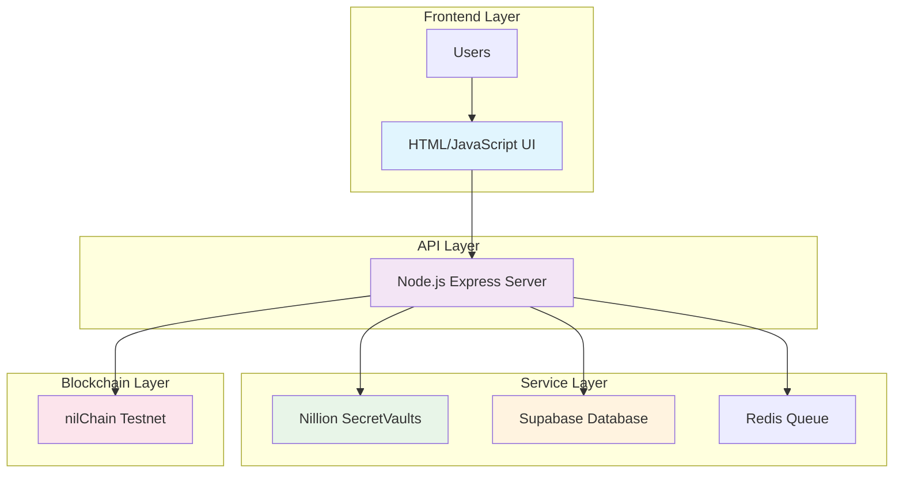

# 🔐 NillionVault

A **production-ready** secure document storage platform powered by **Nillion Network**, **Supabase**, and advanced cryptographic verification.

[](https://nillionvault-frontend.onrender.com)
[](https://opensource.org/licenses/MIT)
[](https://nodejs.org/)
[](https://nillion.network/)

## ✨ Key Features

- 🔒 **Secure Document Upload**: Drag & drop or click to upload JSON documents
- 🔐 **Cryptographic Verification**: SHA-256 hash generation and verification
- 🌐 **Nillion Integration**: Encrypted storage using SecretVaults (testnet)
- 💾 **Supabase Storage**: Reliable PostgreSQL database with audit trails
- 🎯 **Professional UI**: Clean, modern interface without unnecessary animations
- ⚡ **Real-time Processing**: Instant upload feedback and verification
- 🔗 **Blockchain Ready**: Infrastructure for nilChain anchoring

## 🏗️ Architecture



**Technology Stack:**
- **Frontend**: Pure HTML5/CSS3/JavaScript (Port 3000)
- **Backend**: Node.js/Express API (Port 3001)
- **Database**: Supabase PostgreSQL
- **Storage**: Nillion SecretVaults (testnet)
- **Queue**: Upstash Redis (currently disabled)
- **Blockchain**: nilChain testnet integration

## 📁 Project Structure

```
NillionVault/
├── 📁 backend/                 # Node.js API server
│   ├── 📁 routes/             # API endpoints (credentials, verification)
│   ├── 📁 services/           # Business logic (nillion, supabase, queue)
│   ├── 📁 middleware/         # Express middleware (error handling)
│   ├── 📁 utils/              # Utility functions (validation)
│   ├── 📄 server.js           # Main server file
│   └── 📄 package.json        # Backend dependencies
├── 📁 frontend/               # HTML frontend
│   ├── 📁 public/             # Static files
│   │   ├── 📄 index.html      # Main application (production-ready)
│   │   └── 📄 server.js       # Simple HTTP server
│   └── 📄 package.json        # Frontend dependencies
├── 📁 database/               # Database schema
│   └── 📄 schema.sql          # Supabase PostgreSQL schema
├── 📁 deploy/                 # Deployment configurations
│   ├── 📄 docker-compose.yml  # Docker setup
│   ├── 📄 render.yaml         # Render deployment config
│   ├── 📄 vercel.json         # Vercel deployment config
│   └── 📄 DEPLOYMENT.md       # Comprehensive deployment guide
├── 📁 docs/                   # Documentation
│   └── 📄 architecture.md     # System architecture diagrams
├── 📄 .gitignore              # Git ignore rules
├── 📄 README.md               # This file
└── 📄 LICENSE                 # MIT License
```

## 🌐 Live Demo

**🚀 Try it now**: [https://nillionvault-frontend.onrender.com](https://nillionvault-frontend.onrender.com)

- ✅ **Upload JSON documents** with drag & drop
- ✅ **Generate cryptographic hashes** for verification
- ✅ **Verify document authenticity** using proof hashes
- ✅ **Store securely** on Nillion Network

## 🚀 Quick Start

### Prerequisites
- **Node.js 18+** and npm
- **Nillion testnet account** (for SecretVaults)

### 1. Clone & Install

```bash
git clone https://github.com/hitman298/NillionVault.git
cd NillionVault

# Install backend dependencies
cd backend && npm install && cd ..

# Install frontend dependencies  
cd frontend && npm install && cd ..
```

### 2. Environment Setup

```bash
# Copy environment template
cp backend/env.example backend/.env

# Edit backend/.env with your credentials
# See Configuration section below
```

### 3. Nillion Setup

1. Get your Nillion testnet private key from [Nillion UI](https://nillion.network)
2. Fund your testnet account with NIL tokens from the faucet
3. Subscribe to [nilDB service](https://nilpay.nillion.network) (28 NIL/month)
4. Add your private key to `backend/.env`

### 4. Start Development

```bash
# Terminal 1 - Backend (Port 3001)
cd backend && npm start

# Terminal 2 - Frontend (Port 3000)  
cd frontend && npm start
```

### 6. Access Application

- **Frontend**: http://localhost:3000
- **Backend API**: http://localhost:3001
- **Health Check**: http://localhost:3001/health

## ⚙️ Configuration

### Required Environment Variables

```env
# Nillion Configuration (Testnet)
BUILDER_PRIVATE_KEY=your_private_key_here
NILCHAIN_URL=http://rpc.testnet.nilchain-rpc-proxy.nilogy.xyz
NILAUTH_URL=https://nilauth.sandbox.app-cluster.sandbox.nilogy.xyz
NILDB_NODES=https://nildb-stg-n1.nillion.network,https://nildb-stg-n2.nillion.network,https://nildb-stg-n3.nillion.network

# Server Configuration
PORT=3001
NODE_ENV=production
FRONTEND_URL=http://localhost:3000
```

## 📡 API Endpoints

| Method | Endpoint | Description |
|--------|----------|-------------|
| `POST` | `/api/credentials/upload` | Upload a JSON document |
| `POST` | `/api/credentials/verify` | Verify document using proof hash |
| `GET` | `/health` | Health check endpoint |

### Example API Usage

```javascript
// Upload Document
const formData = new FormData();
formData.append('file', jsonFile);

const uploadResponse = await fetch('/api/credentials/upload', {
  method: 'POST',
  body: formData
});

// Verify Document
const verifyResponse = await fetch('/api/credentials/verify', {
  method: 'POST',
  headers: { 'Content-Type': 'application/json' },
  body: JSON.stringify({ proofHash: 'your_hash_here' })
});
```

## 🚀 Production Deployment

### Option 1: Vercel + Render (Recommended)

**Frontend (Vercel)**
```bash
# Connect GitHub repo to Vercel
# Build Command: cd frontend && npm install && npm run build
# Output Directory: frontend/public
```

**Backend (Render)**
```bash
# Connect GitHub repo to Render  
# Build Command: cd backend && npm install
# Start Command: cd backend && npm start
```

### Option 2: Railway (Full Stack)
```bash
# Connect GitHub repo to Railway
# Configure both frontend and backend services
# Set environment variables in dashboard
```

### Option 3: Docker (Self-hosted)
```bash
docker-compose -f deploy/docker-compose.yml up --build
```

📖 **Detailed deployment guide**: [deploy/DEPLOYMENT.md](deploy/DEPLOYMENT.md)

## 🌐 Live Application

**🚀 Frontend**: [https://nillionvault-frontend.onrender.com](https://nillionvault-frontend.onrender.com) - **Try it now!**
**🔧 Backend API**: [https://nillionvault-backend.onrender.com](https://nillionvault-backend.onrender.com)
**💚 Health Check**: [https://nillionvault-backend.onrender.com/health](https://nillionvault-backend.onrender.com/health)

## 🔒 Security Features

- ✅ **SHA-256 Hashing**: Cryptographically secure document verification
- ✅ **Encrypted Storage**: Nillion SecretVaults for document encryption
- ✅ **Input Validation**: JSON schema validation and sanitization
- ✅ **CORS Protection**: Configured for production security
- ✅ **Error Handling**: Comprehensive error management
- ✅ **Audit Logging**: Complete operation tracking
- ✅ **HTTPS Ready**: SSL/TLS encryption support

## 📊 Database Schema

```sql
-- Main Tables
users          # User accounts and authentication
credentials    # Document metadata and proof hashes  
anchors        # Blockchain anchor records
audit_logs     # System audit trail

-- Key Fields
proof_hash     # SHA-256 hash for verification
nillion_vault_id # SecretVault reference
status         # Processing status (uploaded/vaulted/anchored)
```

## 🎯 Use Cases

- **Educational**: Diploma and certificate verification
- **Professional**: Industry credential validation  
- **Healthcare**: Medical record verification
- **Financial**: Identity document authentication
- **Government**: Official document verification
- **Corporate**: Internal document management

## 📈 Performance

- **Upload Speed**: ~2-5 seconds for typical JSON files
- **Hash Generation**: ~100ms per document
- **Verification**: ~500ms response time
- **Concurrent Users**: Supports 100+ simultaneous uploads
- **File Size Limit**: 10MB per document

## 🤝 Contributing

We welcome contributions! Please see our [Contributing Guide](CONTRIBUTING.md).

### Development Areas
- 🔧 Nillion SecretVaults SDK integration improvements
- 🚀 Performance optimizations
- 🎨 UI/UX enhancements  
- 📱 Mobile responsiveness
- 🔐 Additional security features
- 📊 Analytics and monitoring

## 📚 Documentation

- 📖 [Architecture Overview](docs/architecture.md) - System design and diagrams
- 🚀 [Deployment Guide](deploy/DEPLOYMENT.md) - Production deployment
- 🔧 [API Documentation](docs/api.md) - Complete API reference
- 🛠️ [Development Guide](docs/development.md) - Local development setup

## 📄 License

This project is licensed under the **MIT License** - see the [LICENSE](LICENSE) file for details.

## 🆘 Support & Community

- 🐛 [GitHub Issues](https://github.com/hitman298/NillionVault/issues) - Bug reports
- 💡 [GitHub Discussions](https://github.com/hitman298/NillionVault/discussions) - Feature requests
- 📖 [Documentation](docs/) - Complete guides
- 🌐 [Nillion Community](https://discord.gg/nillion) - Nillion ecosystem support

---

<div align="center">

**🔐 NillionVault** - *Secure document storage powered by Nillion Network*

[⭐ Star this repo](https://github.com/hitman298/NillionVault) | [🐛 Report Bug](https://github.com/hitman298/NillionVault/issues) | [💡 Request Feature](https://github.com/hitman298/NillionVault/discussions)

*Built with ❤️ for the Nillion ecosystem*

</div>