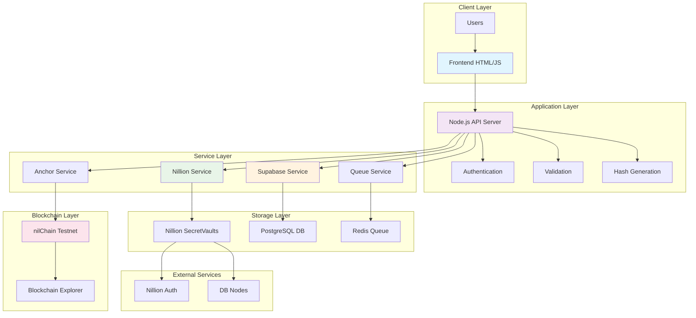
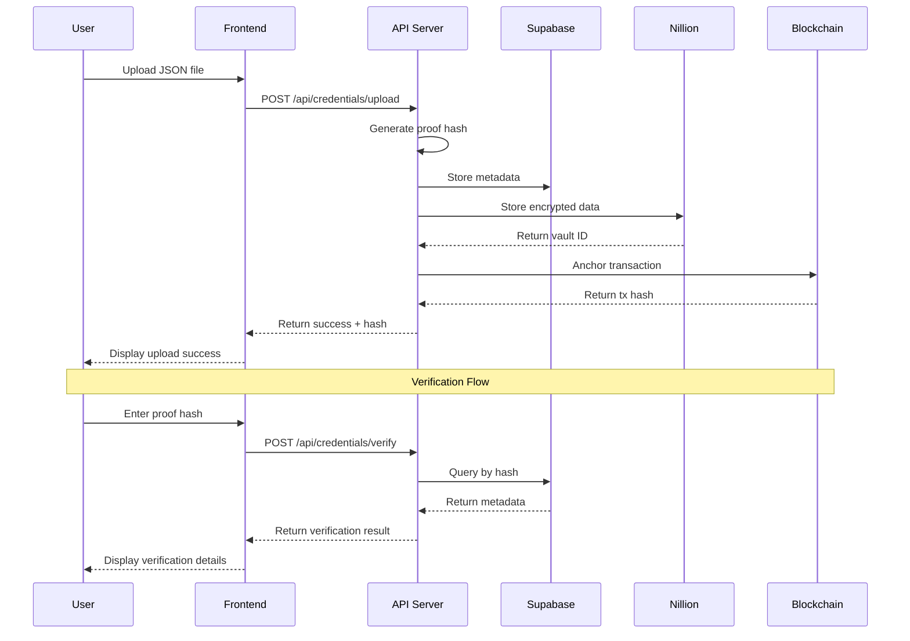
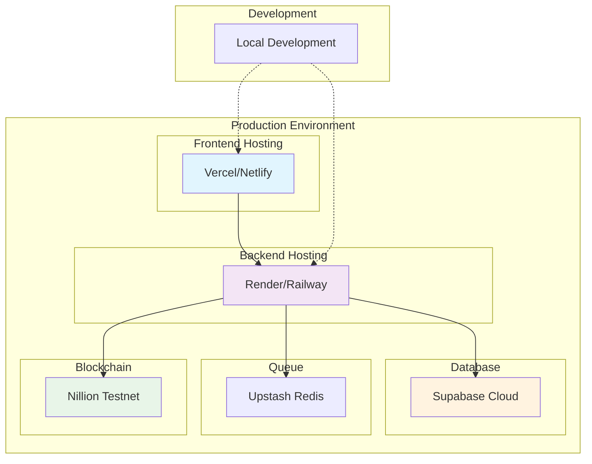

# NillionVault Architecture

## System Overview

NillionVault is a secure document storage platform that leverages Nillion Network's SecretVaults for encrypted storage, Supabase for metadata management, and blockchain anchoring for immutable verification.

## Architecture Diagram

## Component Details

### Frontend (HTML/JavaScript)
- **Technology**: Pure HTML5, CSS3, JavaScript ES6+
- **Port**: 3000
- **Features**: 
  - Drag & drop file upload
  - Real-time progress tracking
  - Hash verification interface
  - Recent uploads display

### Backend API (Node.js)
- **Technology**: Node.js, Express.js
- **Port**: 3001
- **Features**:
  - RESTful API endpoints
  - File upload handling
  - Hash generation and verification
  - Database operations
  - Error handling and logging

### Nillion Integration
- **SecretVaults**: Encrypted document storage
- **Authentication**: Builder registration and token management
- **Network**: Testnet with fallback to Supabase

### Database (Supabase)
- **Technology**: PostgreSQL
- **Schema**: 
  - Users table
  - Credentials table (metadata)
  - Anchors table (blockchain records)
  - Audit logs table

### Queue System (Redis)
- **Technology**: Upstash Redis
- **Purpose**: Background anchoring jobs
- **Status**: Currently disabled (mock mode)

### Blockchain (nilChain)
- **Network**: Testnet
- **Purpose**: Immutable proof anchoring
- **Features**: Transaction hashing and verification

## Data Flow

## Security Model

### Encryption Layers
1. **Transport**: HTTPS/TLS
2. **Storage**: Nillion SecretVaults encryption
3. **Verification**: SHA-256 cryptographic hashing
4. **Blockchain**: Immutable transaction anchoring

### Access Control
- **Public**: Hash verification (read-only)
- **Authenticated**: Document upload and management
- **Admin**: System administration and monitoring

### Data Privacy
- **Encrypted Storage**: Documents stored in encrypted shares
- **Hash-only Verification**: No document content exposed
- **Audit Trail**: Complete operation logging

## Deployment Architecture

## Technology Stack Summary

| Component | Technology | Purpose |
|-----------|------------|---------|
| Frontend | HTML5/CSS3/JS | User interface |
| Backend | Node.js/Express | API server |
| Database | Supabase PostgreSQL | Metadata storage |
| Storage | Nillion SecretVaults | Encrypted document storage |
| Queue | Upstash Redis | Background jobs |
| Blockchain | nilChain Testnet | Proof anchoring |
| Deployment | Vercel/Render | Cloud hosting |

## Performance Considerations

- **File Size Limit**: 10MB per document
- **Concurrent Uploads**: Limited by server capacity
- **Hash Generation**: ~100ms for typical documents
- **Database Queries**: Optimized with proper indexing
- **Blockchain Latency**: ~30 seconds for confirmation

## Scalability

- **Horizontal Scaling**: Stateless API design
- **Database Scaling**: Supabase auto-scaling
- **CDN**: Static assets via Vercel/Netlify
- **Caching**: Redis for session and queue data
